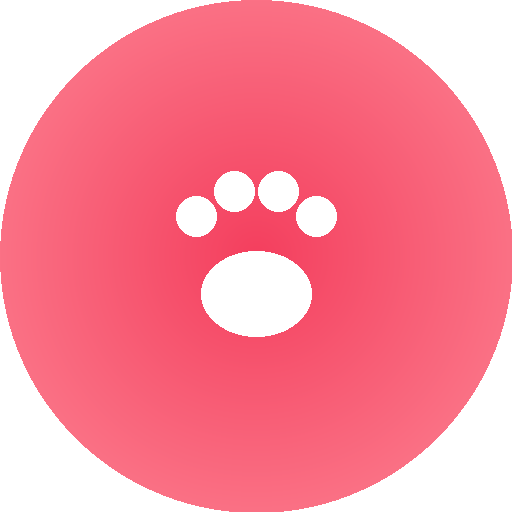

<p align="center">
  
</p>

<h1 align="center">GroomRoom</h1>

<p align="center">
  <strong>Профессиональный груминг для ваших питомцев</strong>
</p>

<p align="center">
  
  
  
  
  
  
</p>

<p align="center">
  
  
  
  
</p>

---

## О проекте

**GroomRoom** — веб-сервис для компании, предоставляющей услуги груминга домашних животных. Зарегистрированные пользователи загружают фотографии своих питомцев, а сотрудники компании публикуют результаты после проведения процедур.

Дизайн ориентирован на целевую аудиторию — девушки и женщины 17–35 лет, которые регулярно пользуются услугами грумеров. Мягкая розово-кремовая палитра, glass-morphism эффекты и плавные анимации создают приятный пользовательский опыт.

---

## Возможности

### Гость
| Функция | Описание |
|---------|----------|
| Просмотр витрины | Последние 4 завершённые работы на главной |
| Регистрация | Создание учётной записи с валидацией |
| Авторизация | Вход по логину и паролю |

### Авторизованный пользователь
| Функция | Описание |
|---------|----------|
| Создание заявки | Кличка + фото питомца (JPEG/BMP, до 2 МБ) |
| Просмотр заявок | Список своих заявок со статусами |
| Удаление заявки | Только заявки со статусом «Новая» |
| Выход | Завершение сессии |

### Администратор
| Функция | Описание |
|---------|----------|
| Управление заявками | Просмотр всех заявок пользователей |
| Смена статуса | Новая → Обработка данных → Услуга оказана |
| Прикрепление результата | Загрузка фото результата при завершении |

---

## Технологии

```
Frontend          Backend           База данных       Анимации
─────────         ───────           ──────────        ────────
Next.js 16        API Routes        SQLite            Framer Motion 12
React 19          iron-session      better-sqlite3    Page transitions
TypeScript 5      bcryptjs                            Staggered lists
Tailwind CSS 4    Server-side                         Hover effects
                  validation                          Micro-interactions
```

---

## Быстрый старт

```bash
# Клонирование
git clone https://github.com/KapaSique/GroomRoom.git
cd GroomRoom

# Установка зависимостей
npm install

# Запуск в режиме разработки
npm run dev

# Сборка для продакшена
npm run build && npm start
```

Откройте **http://localhost:3000** в браузере.

---

## Учётные записи

| Роль | Логин | Пароль |
|------|-------|--------|
| Администратор | `admin` | `grooming` |

Учётная запись администратора создаётся автоматически при первом запуске.

---

## Структура проекта

```
GroomRoom/
├── src/
│   ├── app/
│   │   ├── page.tsx                # Главная страница
│   │   ├── layout.tsx              # Корневой layout
│   │   ├── globals.css             # Глобальные стили
│   │   ├── dashboard/
│   │   │   └── page.tsx            # Личный кабинет
│   │   ├── admin/
│   │   │   └── page.tsx            # Панель администратора
│   │   └── api/
│   │       ├── auth/
│   │       │   ├── register/       # POST — регистрация
│   │       │   ├── login/          # POST — авторизация
│   │       │   └── logout/         # POST — выход
│   │       ├── requests/           # GET/POST/DELETE — заявки
│   │       ├── admin/requests/     # GET/PATCH — управление
│   │       └── showcase/           # GET — витрина
│   ├── components/
│   │   ├── MainPageClient.tsx      # Главная (клиент)
│   │   ├── DashboardClient.tsx     # Кабинет (клиент)
│   │   └── AdminClient.tsx         # Админка (клиент)
│   └── lib/
│       ├── db.ts                   # SQLite подключение
│       └── session.ts              # Управление сессиями
├── public/
│   ├── logo/logo_groom.png         # Логотип
│   └── uploads/                    # Загруженные фото
├── logo/logo_groom.png             # Логотип (корень)
└── package.json
```

---

## Адаптивность

<p align="center">
  
  
</p>

- **Mobile-first** подход с вертикальной раскладкой
- Карточки заявок в одну колонку на мобильных
- Двухколоночная сетка витрины и формы на десктопе
- Sticky-формы авторизации на широких экранах

---

## Валидация

Вся валидация выполняется **на стороне сервера**:

| Поле | Правила |
|------|---------|
| ФИО | Только кириллица и пробелы |
| Логин | Только латиница и дефис, уникальный |
| Email | Валидный формат |
| Пароль | Обязательное поле |
| Повтор пароля | Совпадение с паролем |
| Согласие | Обязательная отметка |
| Фото | JPEG/BMP, максимум 2 МБ |

---

## Анимации

Проект использует **Framer Motion** для создания плавного и современного UX:

- 🎬 Анимация появления элементов (fade-up)
- 🔄 Плавные переходы между формами входа и регистрации
- 📋 Staggered-анимация списков заявок
- 🖱️ Hover-эффекты с масштабированием на кнопках и карточках
- 🗑️ Анимация удаления заявок (slide-out)
- ✨ Декоративные blur-блобы и glass-morphism

---

<p align="center">
  <sub>Сделано с ❤️ для пушистых клиентов</sub>
</p>
